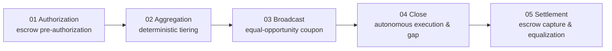

# Threshold-Discount Agent

**An agent that turns individual retail checkouts into wholesale deals — automatically, on Razorpay.**

Built for Razorpay's **AI Growth & Agentic Commerce** track: *grow merchant revenue and make merchants transactable by an AI buyer end to end.*

🔗 **Live demo:** [threshold-discount-agent.vercel.app](https://threshold-discount-agent.vercel.app)
🎥 **Demo video:** (https://drive.google.com/file/d/1Z7Qowxq2fClVwdiHbt37dvNBriOgkVFz/view?usp=drive_link)
---

## The elevator pitch

Multiple buyers can order the same product in the same day, and each still pays full retail, one order at a time — even though wholesale pricing exists for exactly that volume. Nothing at checkout ever notices.

**Threshold-Discount Agent fixes that.** Buyer payments are authorized (not captured) at checkout. A decision engine holds a short aggregation window for that exact product. If demand falls short of a bulk-pricing tier, the engine broadcasts the current offer equally to every eligible buyer who's searched for that product but hasn't purchased — no ranking, no favorites. When the window closes, every pending buyer is captured at whichever discount tier the final quantity actually earned, and the merchant receives one consolidated wholesale-priced settlement.

Every money-moving action is **explainable, bounded, and gated** — the exact bar this track sets:
- A live, timestamped audit trail shows every decision and the reasoning behind it, not just the outcome
- Hard caps on hold duration, discount depth, minimum quantity per tier, and how many times any single buyer can be notified
- One handled failure, by design: if the window closes short of the top tier, the engine doesn't cancel or charge full retail — it computes the exact tier this quantity earned, using a plain interpolation formula, and applies it to every buyer

---

## Architecture


**Flow legend:** solid arrows are real money/data actions (orders, offers, refunds, payouts). Dashed arrows mark deliberate non-actions — a buyer who never converts, or the Control Shopper who is never targeted at all. Both are shown on purpose: proving what *doesn't* happen is as important to "bounded and gated" as showing what does.



---

## AI judgment: where we used it, and where we deliberately didn't

This is the part of the rubric we think about the most, because it's the part most teams skip. Two decisions live in this system that could each plausibly involve an LLM. We only put one of them through a model — and eventually pulled it back out. Here's why.

| Decision | Approach | Why |
|---|---|---|
| **Who gets notified when demand falls short** | Rule-based: broadcast the current offer to the *entire* eligible pool (searched this product, hasn't bought) at the same moment, capped by a per-buyer notification limit | We tried LLM-ranked targeting first. It worked, but it meant some eligible buyers got notified almost instantly while others waited or never got picked — a fairness problem with no clean answer to "why did the AI pick X over Y." Equal treatment removes that question entirely. |
| **What discount percentage applies for an in-between quantity** | Deterministic linear interpolation between two seller-set anchor tiers, e.g. `3% + (3-2)/(4-2) × (10%-3%) = 6.5%` | This number determines how much money moves. It needs to be instant, always available, and explainable in one sentence — not dependent on an external model call that can fail or rate-limit. |

We evaluated using an LLM for both of these and deliberately chose deterministic, rule-based logic instead. Both decisions touch real money or fairness guarantees, where reliability and equal treatment matter more than adaptive reasoning.

---

## What's real vs. what's scoped down for this build

**Real:**
- Razorpay test-mode Orders API — order creation, delayed capture at the computed tier price, refund/adjustment calls
- The full authorize → hold → broadcast → capture state machine driving every panel in the UI
- The deterministic tier-interpolation math, computed live and logged with its actual formula and inputs

**Scoped down for demo purposes:**
- Product catalog, search, and the pool of "recent searchers" (a small in-memory dataset, not a production index)
- Seller-side fulfillment (a mock shipping reference, not a real logistics integration)

The part the rubric actually asks for — explainable, bounded, gated money movement — is the part that's real.

---

## How it works

1. **Authorize, don't capture** — payment is authorized at checkout; funds are held, nothing is charged yet.
2. **Hold the window** — orders for the same product accumulate for a fixed window (compressed to seconds in the demo; ~48h would be the production equivalent).
3. **Broadcast equally when short** — if quantity falls short of a tier, the current offer goes out to every eligible buyer at once — not a ranked subset. Only in the final ~3% of the window (compressed to a larger fraction for the demo, so it's actually visible) — nudging early would be premature; nudging too late would leave no time to convert.
4. **Capture at the earned tier** — every pending buyer is captured at whatever discount tier the final quantity reached, computed with a plain, auditable formula. No refunds needed beyond equalizing early buyers down to the final price; no one pays more than they agreed to.
5. **Reveal fulfillment only after settlement** — buyer-level shipping details are never visible to the seller until the window has actually closed and the tier is final. Before that, the seller only sees a waiting state — not because of a manual step, but because there's nothing final to act on yet.

---

## Demo walkthrough (what you'll see live)

- **Buyer A / Buyer B** — manual buyers, search and pay at whatever price is current when they check out
- **Standing-Order Agent** — told to buy only when the price drops to a set threshold; purchases autonomously the instant a broadcast offer meets that condition, no manual approval step
- **Buyer C** — receives the same broadcast offer as Standing-Order Agent, at the same moment, but may or may not convert — a real, honest outcome, not scripted
- **Control Shopper** — searching an entirely different product the whole time, never receives an offer, proving the broadcast is bounded to actual eligible searchers, not everyone
- **Decision Engine** (center panel) — live order counter, countdown timer, the deterministic interpolation formula with real numbers, and a full audit-trail log of every threshold check, broadcast, and capture decision
- **Seller Settlement** (right panel) — shows nothing but a waiting state until settlement completes, then reveals final payout, applied tier, and a fulfillment list — buyer shipping references only, no pricing data
- **Architecture Workflow tab** — the same 5-phase story as a navigable diagram, for anyone who wants the full picture without reading code

---

## Tech stack

- **Framework:** Next.js (App Router)
- **Language:** TypeScript
- **Styling:** Tailwind CSS
- **Payments:** Razorpay Orders API (test mode) — authorize, delayed capture, refunds

---

## Getting started

**Prerequisites:** Node.js 18+, npm or yarn

```bash
git clone https://github.com/Sukumar-Manivel/threshold-discount-agent.git
cd threshold-discount-agent
npm install
npm run dev
```

Open [http://localhost:3000](http://localhost:3000) in your browser.

---

## Why it matters

- **For merchants:** a confirmed, guaranteed batch order the platform aggregated for free — the discount is effectively a customer-acquisition cost paid in margin instead of ad spend, plus a real demand-planning signal instead of one-at-a-time retail uncertainty.
- **For buyers:** real, automatic savings from demand that was always there — no coupon hunting, no waiting for a sale, and no one treated unequally in how they're offered a deal.
- **For Razorpay:** a form of agentic commerce infrastructure no other PSP offers today — the middleman becomes the one creating value, not just moving it.

*Honest scope note: this model aggregates demand and payment, not shipment — orders still ship individually to each buyer's address. A future version could support consolidated regional pickup, letting sellers capture real logistics savings on top of the demand-aggregation value this version focuses on.*

---

## License

MIT
