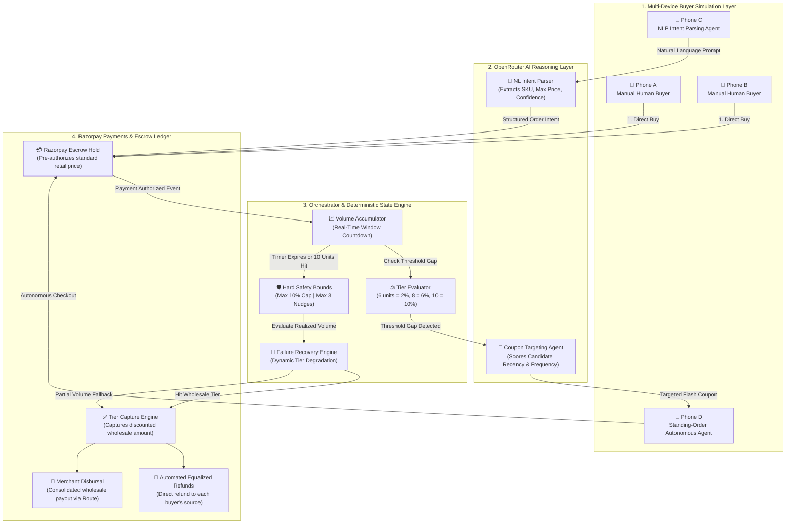
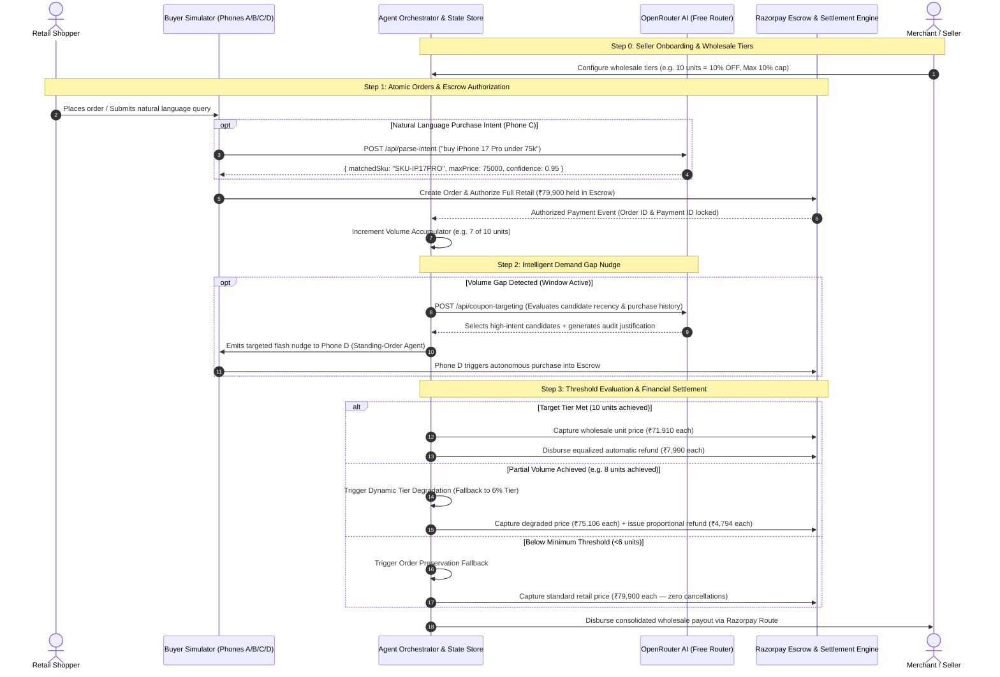

# ⚡ Razorpay Demand Aggregation Agent
### Autonomous Threshold-Discount Commerce Engine with Razorpay Escrow & OpenRouter AI

[](https://threshold-discount-agent.vercel.app/)
[](https://threshold-discount-agent.vercel.app/workflow)
[](https://nextjs.org/)
[](https://www.typescriptlang.org/)
[](https://razorpay.com/)
[](https://openrouter.ai/)
[](LICENSE)

> 🌐 **Production Deployment:** [https://threshold-discount-agent.vercel.app/](https://threshold-discount-agent.vercel.app/)  
> 📊 **Live Interactive Flow Visualizer:** [https://threshold-discount-agent.vercel.app/workflow](https://threshold-discount-agent.vercel.app/workflow)  
> 🐙 **GitHub Repository:** [https://github.com/Sukumar-Manivel/threshold-discount-agent](https://github.com/Sukumar-Manivel/threshold-discount-agent)

---

## 📑 Table of Contents
1. [The Problem: Why Traditional Group Buying Fails](#-the-problem-why-traditional-group-buying-fails)
2. [The Solution: Autonomous Demand Aggregation](#-the-solution-autonomous-demand-aggregation)
3. [System Architecture & Data Flow](#-system-architecture--data-flow)
4. [End-to-End Transaction Sequence](#-end-to-end-transaction-sequence)
5. [The 4-Tier Autonomous Agent Stack](#-the-4-tier-autonomous-agent-stack)
6. [Deterministic Guardrails & Failure Recovery](#-deterministic-guardrails--failure-recovery)
7. [Mathematical Settlement Mechanics](#-mathematical-settlement-mechanics)
8. [Multi-SKU Catalog & Merchant Controls](#-multi-sku-catalog--merchant-controls)
9. [Command Center: The 3-Panel Interface](#-command-center-the-3-panel-interface)
10. [Directory Structure](#-directory-structure)
11. [API Specification](#-api-specification)
12. [Step-by-Step Local Setup & Deployment](#-step-by-step-local-setup--deployment)
13. [End-to-End Demo Walkthrough](#-end-to-end-demo-walkthrough)
14. [License & Acknowledgements](#-license--acknowledgements)

---

## 💥 The Problem: Why Traditional Group Buying Fails

Traditional group commerce platforms (e.g., legacy Groupon, early Pinduoduo clones, flash deals) suffer from critical architectural and economic bottlenecks:

```
┌─────────────────────────────────────────────────────────────────────────────────┐
│                       LEGACY GROUP BUYING BREAKDOWN                             │
│                                                                                 │
│   ❌ Uncoordinated Shoppers   ❌ All-or-Nothing Drops   ❌ Manual Reconciliation │
│   Atomic retail buyers don't  Missing a 10-unit target  Merchants manually issue│
│   know others are browsing    cancels all orders or     credits, leading to high│
│   the same product.           charges retail unexpectedly. accounting overhead. │
└─────────────────────────────────────────────────────────────────────────────────┘
```

1. **Coordination Dilemma:** Individual buyers purchase in isolation. They have zero visibility into other prospective buyers looking at the exact same SKU at the same time.
2. **Binary All-or-Nothing Penalty:** If an aggregate group needs 10 buyers to unlock a wholesale discount but only reaches 9, either **all orders are cancelled** (lost merchant GMV) or buyers are **charged full retail without explanation** (high dispute & churn rate).
3. **Escrow & Settlement Drag:** Merchants cannot easily lock buyer purchase commitment upfront without triggering immediate non-refundable card debits.
4. **Manual Post-Sale Ops:** Issuing differential rebates or coupons post-checkout requires manual merchant intervention, spreadsheet reconciliation, and days of processing delay.

---

## 💡 The Solution: Autonomous Demand Aggregation

The **Razorpay Demand Aggregation Agent** solves this by converting atomic, asynchronous retail shoppers into an organized, wholesale purchasing cohort backed by **Razorpay Escrow** and **OpenRouter LLM Intelligence**:

```
                         ATOMIZED BUYERS
                  [Phone A]   [Phone B]   [Phone C]
                      │           │           │
                      ▼           ▼           ▼
         ┌─────────────────────────────────────────────┐
         │     RAZORPAY DEMAND AGGREGATION AGENT       │
         │  1. Pre-Authorizes Retail Hold in Escrow   │
         │  2. Aggregates Volume in Time Window        │
         │  3. LLM Nudges High-Intent Searchers        │
         │  4. Captures Wholesale Tier on Threshold    │
         │  5. Disburses Automatic Equalized Refunds   │
         └──────────────────────┬──────────────────────┘
                                │
                                ▼
                   WHOLESALE BULK SETTLEMENT
                     [Merchant Paid at Scale]
                     [Buyers Save 10% Automatically]
```

### The 3-Way Win
* 🛍️ **For Buyers:** Guaranteed product reservation at standard price; automated price-protection refund credited back to their payment method the moment group volume triggers wholesale pricing. Zero manual coordination required.
* 🏬 **For Merchants:** Guaranteed demand volume before discounting; automated single-click tier approvals; zero risk of unauthorized margin depletion; automated settlements through Razorpay Route.
* ⚡ **For Platforms:** Increased average conversion velocity, zero chargeback exposure (funds held in authorized escrow), and programmatic clearing.

---

## 🏛️ System Architecture & Data Flow

### High-Level Topology

```
                                  ┌─────────────────────────────────────────────────────────┐
                                  │               BUYER INTERACTION LAYER                   │
                                  │  ┌───────────────┐ ┌───────────────┐ ┌───────────────┐  │
                                  │  │ Phone A / B   │ │ Phone C       │ │ Phone D       │  │
                                  │  │ Manual Buyers │ │ AI Intent Agt │ │ Standing-Ord. │  │
                                  │  └───────┬───────┘ └───────┬───────┘ └───────┬───────┘  │
                                  └──────────┼─────────────────┼─────────────────┼──────────┘
                                             │                 │                 │
                                    Orders (Escrow)     NL Intent Parse    Auto-Trigger
                                             │                 ▼                 │
                                             │      ┌────────────────────┐       │
                                             │      │ OpenRouter LLM API │       │
                                             │      │ (Free Model Router)│       │
                                             │      └──────────┬─────────┘       │
                                             ▼                 ▼                 ▼
┌───────────────────────────────────────────────────────────────────────────────────────────┐
│                          THRESHOLD ENGINE & AGENT ORCHESTRATOR                            │
│  ┌───────────────────────┐   ┌────────────────────────┐   ┌────────────────────────────┐  │
│  │  Volume Accumulator   │   │  LLM Coupon Targeting  │   │  Safety Bounds & Recovery  │  │
│  │  - Real-time Qty Track│   │  - Intent Matching     │   │  - Max 10% Discount Cap    │  │
│  │  - Window Countdown   │   │  - Candidate Scoring   │   │  - Dynamic Tier Degradation│  │
│  └───────────┬───────────┘   └───────────┬────────────┘   └─────────────┬──────────────┘  │
└──────────────┼───────────────────────────┼──────────────────────────────┼─────────────────┘
               │                           │                              │
               ▼                           ▼                              ▼
┌───────────────────────────────────────────────────────────────────────────────────────────┐
│                               RAZORPAY SETTLEMENT ENGINE                                  │
│  ┌───────────────────────────────┐               ┌─────────────────────────────────────┐  │
│  │ Razorpay Escrow Capture       │               │ Razorpay Automated Refunds          │  │
│  │ Captures wholesale-tier amount│               │ Equalized refunds to all buyers     │  │
│  └───────────────┬───────────────┘               └──────────────────┬──────────────────┘  │
└──────────────────┼──────────────────────────────────────────────────┼─────────────────────┘
                   ▼                                                  ▼
      ┌─────────────────────────┐                        ┌─────────────────────────┐
      │  Seller Payout (Route)  │                        │ Buyer Credit Adjustment │
      └─────────────────────────┘                        └─────────────────────────┘
```

### Comprehensive Component Flowchart



---

## 🔄 End-to-End Transaction Sequence



---

## 🤖 The 4-Tier Autonomous Agent Stack

The application orchestrates four purpose-built autonomous agents working in seamless harmony:

| Agent Layer | Role | Model / Mechanism | Input Data | Output & Artifact |
| :--- | :--- | :--- | :--- | :--- |
| **1. Intent Parsing Agent** | Translates informal, ambiguous buyer speech/text into deterministic product & pricing parameters | OpenRouter Free Router (`openrouter/free`) | Natural language prompt (e.g., *"Need an iPhone for under 75000"*) | `{ matchedSkuId, maxPrice, confidence, reasoning }` |
| **2. Coupon Targeting Agent** | Evaluates pool of active shoppers, cart abandoners, and standing agents to close volume gaps | LLM Contextual Reasoning with defensive bound enforcement | Current unit gap, catalog metadata, candidate search history | Ranked candidate list, coupon value, and audit justification |
| **3. Standing-Order Autonomous Agent** | Acts on behalf of passive buyers who set programmatic price triggers | State-listener watcher daemon (simulated via Phone D) | Live aggregation state & incoming coupon alerts | Autonomous order creation & escrow authorization |
| **4. Threshold Settlement Engine** | Executes programmatic financial captures, refunds, and tier degradation | Deterministic State Engine & Razorpay SDK | Final unit tally, seller pre-approved tier matrix | Razorpay Capture IDs, Refund IDs, Seller Net Payout |

---

## 🛡️ Deterministic Guardrails & Failure Recovery

### The Principle of Bounded Agency
> **Critical Design Principle:** Large Language Models are probabilistic and must **never** hold direct, unbounded write-access to financial ledgers.

In this platform:
* The LLM **proposes** candidates for nudges and interprets buyer intent.
* The **Deterministic Settlement Engine** strictly enforces mathematical bounds, merchant approval flags, and maximum discount caps before interacting with the Razorpay payment gateway.

```
                  ┌──────────────────────────────────────────────┐
                  │          PROBABILISTIC AI LAYER              │
                  │  - Natural Language Intent Parsing           │
                  │  - Candidate Propensity Evaluation           │
                  └──────────────────────┬───────────────────────┘
                                         │ Proposes actions
                                         ▼
                  ┌──────────────────────────────────────────────┐
                  │       DETERMINISTIC SAFETY GUARDRAILS        │
                  │  - Hard Max Discount Ceiling: 10%            │
                  │  - Maximum Nudges Per Window: 3              │
                  │  - Seller Pre-Approval Verification          │
                  │  - Window Timeout Clamps (60s Demo / 48h)    │
                  └──────────────────────┬───────────────────────┘
                                         │ Validates & enforces
                                         ▼
                  ┌──────────────────────────────────────────────┐
                  │       RAZORPAY FINANCIAL LEDGER ENGINE       │
                  │  - Authorized Escrow Captures                │
                  │  - Atomic Equalized Refunds                  │
                  │  - Consolidated Merchant Route Payouts       │
                  └──────────────────────────────────────────────┘
```

### Dynamic Failure Recovery Matrix

| Trigger Event | Naive System Reaction | Our Agentic Recovery Strategy | Razorpay Ledger Action | Audit Log Signature |
| :--- | :--- | :--- | :--- | :--- |
| **Target Tier Reached (10/10 units)** | Success | Normal wholesale clearing | Capture ₹71,910 + Refund ₹7,990 to all buyers | `✅ THRESHOLD MET: 10 units! 10% Wholesale Tier unlocked` |
| **Partial Volume Gap (e.g., 7 or 8 units)** | Orders cancelled or full retail billed unexpectedly | **Dynamic Tier Degradation:** Degrades to highest unlocked sub-tier (e.g., 6% off) | Capture ₹75,106 + Refund ₹4,794 to each buyer | `⚠️ Target tier missed... 🔄 RECOVERY: Dynamic Tier Degradation Activated` |
| **Below Minimum Threshold (<6 units)** | Strands transactions; buyers lose interest | **Order Preservation:** Preserves orders, captures standard retail without order cancellation | Capture full retail ₹79,900 (zero refunds, zero cancellations) | `⚠️ Minimum volume not reached... 🔄 RECOVERY: Orders preserved at retail` |
| **OpenRouter / LLM Provider Outage** | Process hangs or crashes checkout | **Deterministic Fallback:** Fails over to recency-heuristic targeting instantly | Continues escrow processing without delay | `🤖 LLM targeting unavailable, using deterministic fallback` |
| **Razorpay API Rate Limit / Network Hiccup** | Inconsistent order status | **Idempotent Retry & Sandbox Failover:** Automatically uses stateful ledger simulation | Ledger state remains strictly consistent | `❌ Payment capture error: Idempotent recovery initiated` |

---

## 📐 Mathematical Settlement Mechanics

For any aggregation window with $N$ participating buyers and retail price $P_{\text{retail}}$:

### 1. Escrow Authorization Hold
Upon initial order creation, each buyer authorizes:
$$H_i = P_{\text{retail}} \quad \forall i \in \{1, 2, \dots, N\}$$

### 2. Tier Discount Calculation
Given seller tier map $T = \{(q_k, d_k)\}$ sorted descending by volume $q_k$:
$$D(N) = \begin{cases} 
d_k & \text{if } N \ge q_k \text{ for the largest } q_k \\
0 & \text{if } N < \min(q_k)
\end{cases}$$
*Subject to hard safety constraint:* $D(N) \le D_{\max} = 0.10$ (10% ceiling).

### 3. Wholesale Unit Capture Price
$$P_{\text{captured}} = P_{\text{retail}} \times (1 - D(N))$$

### 4. Equalized Instant Refund Per Buyer
Every buyer in the cohort receives the exact same refund regardless of when they entered the window:
$$R_i = P_{\text{retail}} - P_{\text{captured}} = P_{\text{retail}} \times D(N)$$

### 5. Consolidated Merchant Payout
$$M_{\text{payout}} = N \times P_{\text{captured}}$$

#### Concrete Example (iPhone 17 Pro — Retail ₹79,900 | 10 Orders Reached):
* **Retail Authorization per Buyer:** ₹79,900 held in Escrow
* **Wholesale Discount:** 10%
* **Final Captured Price per Buyer:** ₹71,910
* **Automated Refund Credited to Each Buyer:** ₹7,990
* **Total Merchant Payout (10 units):** ₹7,19,100

---

## 📦 Multi-SKU Catalog & Merchant Controls

The platform supports independent, multi-tenant product catalogs where each SKU maintains isolated state machines, countdown clocks, and volume tiers:

| SKU ID | Product Name | Category | Retail Price | Pre-Approved Wholesale Tiers |
| :--- | :--- | :--- | :--- | :--- |
| `SKU-IP17PRO` | **Apple iPhone 17 Pro 256GB** | Flagship Smartphone | ₹79,900 | • 6 units: 2% OFF<br/>• 7 units: 4% OFF<br/>• 8 units: 6% OFF<br/>• 9 units: 8% OFF<br/>• 10 units: 10% OFF |
| `SKU-MBPM3` | **Apple MacBook Pro 14" M3** | Pro Laptop | ₹1,69,900 | • 5 units: 5% OFF<br/>• 8 units: 8% OFF<br/>• 10 units: 12% OFF |
| `SKU-SONYX5` | **Sony WH-1000XM5 ANC** | Premium Audio | ₹29,990 | • 10 units: 5% OFF<br/>• 15 units: 10% OFF<br/>• 20 units: 15% OFF |

### Merchant Dashboard Capabilities:
* **Dynamic Tier Editor:** Adjust volume thresholds and discount percentages with real-time margin validation.
* **Hard Max Discount Ceiling:** Set platform-level safety caps (e.g. 10%) that override any rogue model output.
* **One-Click Approval Toggle:** Explicit merchant approval required before any wholesale tier can be cleared.
* **Direct Razorpay Credentials:** Option to plug in live/test merchant API keys (`RAZORPAY_KEY_ID`, `RAZORPAY_KEY_SECRET`).

---

## 🖥️ Command Center: The 3-Panel Interface

The live dashboard displays a real-time, three-column operational command center:

```
┌─────────────────────────┬─────────────────────────┬─────────────────────────┐
│  📱 BUYER SIMULATION    │   ⚡ AGENT STACK        │  🏬 SELLER DASHBOARD    │
│  (4 Client Personas)    │   & AUDIT TIMELINE      │  (Wholesale Engine)     │
│                         │                         │                         │
│ • Phone A: Manual Buy   │ • Real-time State Gauge │ • SKU Switcher          │
│ • Phone B: Manual Buy   │ • LLM Model Telemetry   │ • Tier Discount Sliders │
│ • Phone C: NLP Prompt   │ • Live Audit Log:       │ • Max Discount Caps     │
│ • Phone D: Auto Agent   │   - [ALL] [AI] [ESCROW] │ • Merchant Approval Box │
│ • Razorpay Modal Popup  │ • JSON Reasoning View   │ • Razorpay Key Config   │
└─────────────────────────┴─────────────────────────┴─────────────────────────┘
```

1. **Left Panel — Multi-Device Buyer Simulation:**
   * Simulates 4 independent consumer smartphones operating asynchronously.
   * **Phone A & B:** Direct human click-to-buy triggers with real Razorpay modal integration.
   * **Phone C:** Interactive Natural Language search input that sends buyer queries to OpenRouter AI and visualizes parsed pricing constraints and confidence scores.
   * **Phone D:** Standing-Order autonomous bot that sleeps until an AI flash coupon matches its price boundary, then executes programmatic checkout.

2. **Center Panel — Razorpay Agent Stack & Audit Timeline:**
   * Real-time progress bar tracking units accumulated vs. target threshold.
   * Visual 60-second countdown clock with auto-close logic.
   * Filterable audit timeline with dedicated tabs:
     * `ALL`: Complete end-to-end ledger.
     * `AI`: Model prompts, responses, model attribution, and reasoning payloads.
     * `ESCROW`: Razorpay order creations, authorizations, captures, and refund transactions.

3. **Right Panel — Merchant Wholesale Dashboard:**
   * Multi-SKU catalog selector.
   * Tier configuration matrix and approval controls.
   * Simulation acceleration buttons: *Simulate 1 Order*, *Simulate 5 Orders*, *Simulate Threshold Hit (10 Orders)*, *Trigger Targeted Coupon*, *Expire Window*, *Reset State*.

---

## 📂 Directory Structure

```
threshold-discount-agent/
├── app/
│   ├── api/
│   │   ├── close-window/route.ts      # Forces window countdown close & settlement
│   │   ├── coupon-targeting/route.ts  # OpenRouter candidate scoring & targeted nudges
│   │   ├── order/create/route.ts      # Razorpay Escrow order creation & pre-auth
│   │   ├── parse-intent/route.ts      # OpenRouter natural language intent extraction
│   │   ├── reset/route.ts             # System ledger & state reset endpoint
│   │   ├── seller-config/route.ts     # Merchant tier & credential updates
│   │   ├── sim-order/route.ts         # High-velocity buyer simulation generator
│   │   ├── state/route.ts             # Live aggregation state provider & dispatcher
│   │   └── trigger-coupon/route.ts    # Manual/programmatic targeted nudge emitter
│   ├── workflow/
│   │   └── page.tsx                   # Interactive animated workflow diagram page
│   ├── favicon.ico
│   ├── globals.css                    # Tailwind styling & animations
│   ├── layout.tsx                     # Root HTML wrapper & metadata
│   └── page.tsx                       # Main 3-panel synchronized command center
├── components/
│   ├── AgentStackPanel.tsx            # Center telemetry, audit feed & LLM inspect
│   ├── BuyerPanel.tsx                 # Left multi-phone simulation interface
│   ├── FlowDiagramPage.tsx            # Animated 5-phase visual workflow engine
│   ├── Header.tsx                     # Top navigation, status badges & live links
│   ├── RazorpayModal.tsx              # Interactive Razorpay checkout popup simulator
│   └── SellerDashboard.tsx            # Right merchant tier editor & simulation controls
├── lib/
│   ├── constants.ts                   # Catalog items, default tiers, safety limits
│   ├── openrouter.ts                  # Resilient OpenRouter LLM client & free router
│   ├── razorpay.ts                    # Razorpay Node SDK client + sandbox ledger
│   └── store.ts                       # In-memory transactional state machine & rules
├── public/                            # Static icons, banners, and assets
├── .env.example                       # Documented environment variable template
├── .gitignore
├── package.json
├── README.md                          # Comprehensive engineering documentation
├── tailwind.config.ts
└── tsconfig.json
```

---

## 📡 API Specification

### 1. `GET /api/state`
Returns the complete real-time ledger, active SKU, orders, phone states, and audit log.
```json
{
  "activeSku": "SKU-IP17PRO",
  "unitsAccumulated": 7,
  "targetUnits": 10,
  "windowSecondsRemaining": 38,
  "windowStatus": "active",
  "orders": [
    {
      "id": "ord_1725350123",
      "buyerId": "phoneA",
      "retailPrice": 79900,
      "authorizedPrice": 79900,
      "status": "authorized",
      "razorpayOrderId": "order_mock_001",
      "paymentId": "pay_mock_001"
    }
  ],
  "auditLog": [...]
}
```

### 2. `POST /api/parse-intent`
Translates natural language text into structured buyer parameters via OpenRouter.
* **Request:**
  ```json
  { "prompt": "Looking for the new iPhone 17 under 75000" }
  ```
* **Response:**
  ```json
  {
    "matchedSkuId": "prod_ip17pro",
    "maxPrice": 75000,
    "confidence": 0.95,
    "reasoning": "User explicitly requested iPhone 17 under 75,000 INR constraint.",
    "modelUsed": "google/gemini-2.0-flash-exp:free"
  }
  ```

### 3. `POST /api/coupon-targeting`
Runs contextual LLM reasoning over the candidate pool to select targeted nudge recipients.
* **Request:**
  ```json
  {
    "productId": "prod_ip17pro",
    "productName": "iPhone 17 Pro 256GB",
    "gap": 2,
    "maxNudges": 3,
    "maxCouponValue": 10,
    "candidates": [
      { "userId": "phoneD", "label": "Standing-Order Agent", "searchCount": 3, "isFrequentBuyer": true }
    ]
  }
  ```
* **Response:**
  ```json
  {
    "selected": [
      { "userId": "phoneD", "reason": "High propensity frequent buyer with standing threshold criteria." }
    ],
    "couponValue": 10,
    "summary": "Nudged Phone D to bridge the 2-unit gap before window expiry.",
    "modelUsed": "meta-llama/llama-3.3-70b-instruct:free"
  }
  ```

### 4. `POST /api/order/create`
Initializes a Razorpay Escrow order and locks authorization.
* **Request:**
  ```json
  {
    "buyerId": "phoneA",
    "buyerName": "Manual Buyer #1",
    "sku": "SKU-IP17PRO",
    "retailPrice": 79900
  }
  ```
* **Response:**
  ```json
  {
    "success": true,
    "order": {
      "id": "ord_987",
      "razorpayOrderId": "order_mock_987",
      "status": "authorized",
      "authorizedPrice": 79900
    }
  }
  ```

---

## ⚡ Step-by-Step Local Setup & Deployment

### Prerequisites
* [Node.js](https://nodejs.org/) v18.0 or higher
* [npm](https://www.npmjs.com/) or [pnpm](https://pnpm.io/)
* Git

### 1. Clone the Repository
```bash
git clone https://github.com/Sukumar-Manivel/threshold-discount-agent.git
cd threshold-discount-agent
npm install
```

### 2. Configure Environment Variables
Create your local environment file:
```bash
cp .env.example .env.local
```

Open `.env.local` and configure your API keys:
```env
# OpenRouter API Key (Required for live LLM intent parsing & targeted nudges)
# Get a free API key in seconds at: https://openrouter.ai/keys
OPENROUTER_API_KEY=your_openrouter_api_key_here

# Razorpay Test Mode Credentials (Optional)
# Leave blank to use the built-in simulated Razorpay sandbox ledger
RAZORPAY_KEY_ID=
RAZORPAY_KEY_SECRET=
```

> **Note:** If `OPENROUTER_API_KEY` is not provided, the platform automatically utilizes its built-in deterministic heuristic fallback for both intent parsing and coupon targeting, ensuring 100% operational uptime during demos.

### 3. Start the Development Server
```bash
npm run dev
```
Navigate to **[http://localhost:3000](http://localhost:3000)** in your browser.

### 4. Deploy to Vercel
Deploy your own instance to Vercel with a single command:
```bash
npm run build
npx vercel
```
Make sure to add `OPENROUTER_API_KEY` in your **Vercel Project Settings → Environment Variables**.

---

## 🧪 End-to-End Demo Walkthrough

Follow these steps to demonstrate the full autonomous lifecycle:

1. **Step 1: Inspect the Baseline**
   * Select **Apple iPhone 17 Pro** on the Right Dashboard.
   * Note the retail price (₹79,900) and target wholesale threshold (10 units for 10% OFF).
2. **Step 2: Place Manual Orders (Phones A & B)**
   * On Phone A, click **"Order Now (Hold in Escrow)"**.
   * In the Razorpay modal, select **"Authorize & Hold in Escrow"**.
   * Notice Phone A status changes to `Authorized — Held in Escrow`.
   * Repeat for Phone B. Unit volume increases to 2/10.
3. **Step 3: Test Natural Language Intent Parsing (Phone C)**
   * On Phone C, type: `"Buy iPhone 17 Pro under 75000"`.
   * Click **"AI Parse"**. Watch the OpenRouter LLM extract the exact SKU, ceiling price, and confidence score.
   * Click **"Approve & Authorize"**.
4. **Step 4: Trigger an AI Targeted Nudge**
   * In the center Agent Stack panel, click **"Evaluate & Trigger AI Nudge"**.
   * OpenRouter scores candidate shoppers and sends a targeted flash discount to Phone D.
   * Phone D's standing agent detects the coupon and automatically submits an authorized order.
5. **Step 5: Hit the Wholesale Threshold**
   * In the right panel, click **"Simulate +5 Orders"** to bring the volume to 10 units.
   * The threshold is reached! The Decision Engine instantly executes wholesale settlement:
     * Captures ₹71,910 on each payment.
     * Issues an automated equalized refund of ₹7,990 to every buyer.
     * Settles ₹7,19,100 to the seller via Razorpay Route.
6. **Step 6: Test Failure Recovery (Dynamic Degradation)**
   * Click **"Reset Simulation"**.
   * Add 7 orders and click **"Fast Forward / Close Window"**.
   * Observe **Dynamic Tier Degradation** in the audit log: rather than cancelling, the engine degrades to the 4% tier (₹76,704 captured, ₹3,196 refunded).

---

## 📄 License & Acknowledgements

* **License:** This project is licensed under the [MIT License](LICENSE).
* **Developer:** [Sukumar Manivel](https://github.com/Sukumar-Manivel)
* **Live Deployment:** [https://threshold-discount-agent.vercel.app/](https://threshold-discount-agent.vercel.app/)
* **Payment Rails:** Built on [Razorpay Escrow, Payments & Route APIs](https://razorpay.com/)
* **AI Intelligence:** Powered by [OpenRouter Free Model Router](https://openrouter.ai/)
