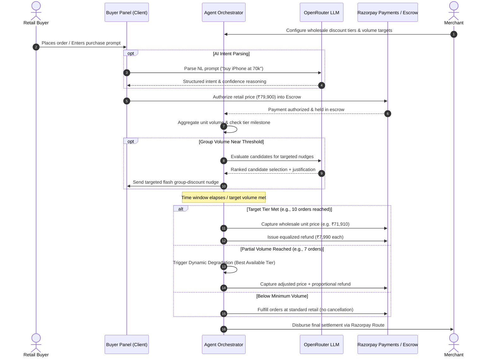

# ⚡ Razorpay Demand Aggregation Agent
### Autonomous Threshold-Discount Commerce Engine with Razorpay Escrow & OpenRouter AI

[](https://threshold-discount-agent.vercel.app/)
[](https://nextjs.org/)
[](https://www.typescriptlang.org/)
[](https://razorpay.com/)
[](https://openrouter.ai/)
[](LICENSE)

> 🌐 **Live Production Link:** [https://threshold-discount-agent.vercel.app/](https://threshold-discount-agent.vercel.app/)  
> 📊 **Interactive Flow Diagram:** [https://threshold-discount-agent.vercel.app/workflow](https://threshold-discount-agent.vercel.app/workflow)

---

## 💡 Overview

Traditional group-buying platforms suffer from high churn, rigid minimum order quantities, and manual post-sale reconciliation. If a group falls short of a volume threshold, orders are either cancelled or buyers are charged full retail without explanation.

**The Razorpay Demand Aggregation Agent** turns atomic, uncoordinated retail buyers into an aggregated wholesale purchasing cohort:
1. **Holds funds securely in Razorpay Escrow** at standard retail price upon initial checkout.
2. **Aggregates demand dynamically** across time-bounded windows.
3. **Deploys LLM-powered targeting & reasoning** (via OpenRouter) to evaluate candidate intent and nudge high-intent shoppers.
4. **Negotiates wholesale tier pricing** pre-approved by the seller.
5. **Executes automated equalized settlements** — capturing discounted payments and disbursing automatic refunds back to buyers without manual merchant intervention.

---

## 🏛️ System Architecture

### High-Level Architecture

```
                                  ┌─────────────────────────────────────────────────────────┐
                                  │               BUYER INTERACTION LAYER                   │
                                  │  ┌───────────────┐ ┌───────────────┐ ┌───────────────┐  │
                                  │  │ Phone A / B   │ │ Phone C       │ │ Phone D       │  │
                                  │  │ Manual Buyers │ │ AI Phone Agt  │ │ Standing-Ord. │  │
                                  │  └───────┬───────┘ └───────┬───────┘ └───────┬───────┘  │
                                  └──────────┼─────────────────┼─────────────────┼──────────┘
                                             │                 │                 │
                                    Orders (Escrow)     NL Intent Parse    Auto-Trigger
                                             │                 ▼                 │
                                             │      ┌────────────────────┐       │
                                             │      │ OpenRouter LLM API │       │
                                             │      │ (Free Model Router)│       │
                                             │      └──────────┬─────────┘       │
                                             ▼                 ▼                 ▼
┌───────────────────────────────────────────────────────────────────────────────────────────┐
│                          THRESHOLD ENGINE & AGENT ORCHESTRATOR                            │
│  ┌───────────────────────┐   ┌────────────────────────┐   ┌────────────────────────────┐  │
│  │  Volume Accumulator   │   │  LLM Coupon Targeting  │   │  Safety Bounds & Recovery  │  │
│  │  - Real-time Qty Track│   │  - Intent Matching     │   │  - Max 10% Discount Cap    │  │
│  │  - Window Countdown   │   │  - Candidate Selection │   │  - Dynamic Tier Degradation│  │
│  └───────────┬───────────┘   └───────────┬────────────┘   └─────────────┬──────────────┘  │
└──────────────┼───────────────────────────┼──────────────────────────────┼─────────────────┘
               │                           │                              │
               ▼                           ▼                              ▼
┌───────────────────────────────────────────────────────────────────────────────────────────┐
│                               RAZORPAY SETTLEMENT ENGINE                                  │
│  ┌───────────────────────────────┐               ┌─────────────────────────────────────┐  │
│  │ Razorpay Escrow Capture       │               │ Razorpay Automated Refunds          │  │
│  │ Captures wholesale-tier amount│               │ Equalized refunds to all buyers     │  │
│  └───────────────┬───────────────┘               └──────────────────┬──────────────────┘  │
└──────────────────┼──────────────────────────────────────────────────┼─────────────────────┘
                   ▼                                                  ▼
      ┌─────────────────────────┐                        ┌─────────────────────────┐
      │  Seller Payout (Route)  │                        │ Buyer Credit Adjustment │
      └─────────────────────────┘                        └─────────────────────────┘
```

### End-to-End Transaction Sequence



---

## 🤖 Agentic Architecture & LLM Integration

The platform is designed around four specialized agentic layers:

| Layer | Responsibility | Model / Mechanism | Output Artifact |
| :--- | :--- | :--- | :--- |
| **1. Intent Parsing Agent** | Translates natural language buyer prompts into SKU, ceiling price, and purchase parameters | OpenRouter Free Router (`openrouter/free`) | `{ matchedSkuId, maxPrice, confidence, reasoning }` |
| **2. Coupon Targeting Agent** | Evaluates cart history, browsing context, and recency to select high-propensity buyers for nudges | LLM Contextual Reasoning | Selected candidate IDs + one-line targeting justification |
| **3. Autonomous Standing Order Agent** | Simulates programmatic buyer agent that triggers checkout when target tier price matches constraints | State-listener watcher | Autonomous order submission into Escrow |
| **4. Threshold Settlement Engine** | Validates safety bounds, applies fallback strategies, and directs Razorpay Escrow captures | Deterministic Rule & Settlement Engine | Razorpay Capture IDs, Refund IDs, and Settlement breakdown |

---

## 🛡️ Guardrails, Bounds & Failure Recovery

To prevent runaway behavior and protect financial integrity, all money actions are strictly **bounded, explainable, and gated**:

```
                              ┌───────────────────────────┐
                              │     GATED & BOUNDED       │
                              └─────────────┬─────────────┘
                                            │
               ┌────────────────────────────┼────────────────────────────┐
               ▼                            ▼                            ▼
     [ EXPLAINABILITY ]             [ HARD BOUNDS ]              [ GATED ACTIONS ]
    Every LLM decision logged       Max discount depth: 10%      Buyer checkout consent
    with exact model name,         Target volume caps: 10 units  Seller approval on tier
    prompt tokens & reasoning      Countdown bounds: 60s/48h     Explicit escrow auth
```

### Failure Recovery Matrix

| Scenario | Naive System Behavior | Our Agentic Recovery | Audit Log Signature |
| :--- | :--- | :--- | :--- |
| **Partial Threshold Miss** *(e.g., 7 of 10 reached)* | Orders cancelled or full retail charged unexpectedly | **Dynamic Tier Degradation:** Degrades to best achievable tier (e.g., 4% or 6% off) and issues proportional Razorpay refunds. | `⚠️ Target tier missed... 🔄 RECOVERY: Dynamic Discount Activated` |
| **Below Minimum Volume** *(e.g., <6 units)* | Strands buyer & merchant transactions | **Order Preservation:** Preserves orders, captures standard retail without cancellation. | `⚠️ Minimum volume not reached... 🔄 RECOVERY: Orders preserved` |
| **LLM Provider Outage / Timeout** | Checkout process freezes | **Deterministic Fallback:** Automatically switches to heuristic targeting without interrupting escrow flow. | `🤖 LLM targeting unavailable, using deterministic fallback` |
| **Escrow Capture Failure** | Inconsistent ledger | **Idempotent Retry & Reversal:** Safely logs failed captures and maintains idempotency keys. | `❌ Capture failed: Idempotent recovery initiated` |

---

## 🖥️ Interactive Demo Surface

The dashboard orchestrates three synchronized operational views:

```
┌─────────────────────────┬─────────────────────────┬─────────────────────────┐
│     BUYER SIMULATION    │       AGENT STACK       │    SELLER DASHBOARD     │
│   (Multi-Client Phone)  │    & AUDIT TIMELINE     │   (Merchant Controls)   │
│                         │                         │                         │
│ • Phone A & B (Manual)  │ • Live State Telemetry  │ • Multi-SKU Selector    │
│ • Phone C (AI Parser)   │ • Real-time LLM Output  │ • Tier Volume Sliders   │
│ • Phone D (Auto Agent)  │ • Audit Log Filters:    │ • Max Discount Depths   │
│ • Escrow Status Badges  │   [ALL] [AI] [ESCROW]   │ • Live Credentials      │
└─────────────────────────┴─────────────────────────┴─────────────────────────┘
```

1. **Buyer Simulation (Left):** Simulates 4 distinct consumer devices interacting simultaneously (manual clicks, natural language voice-to-text parsing, and standing-order triggers).
2. **Agent Stack & Audit Trail (Center):** Shows real-time decision logs, model attribution, confidence scores, and raw JSON payloads.
3. **Seller Wholesale Dashboard (Right):** Enables merchants to onboard products, define volume tiers, approve wholesale discounts, and configure API keys.

---

## 📦 Multi-SKU Support

Each product maintains isolated aggregation timers, tier tables, and escrow balances:
* 📱 **Apple iPhone 17 Pro 256GB** (Retail: ₹79,900 — Tiers: 6 units @ 4%, 8 units @ 6%, 10 units @ 10%)
* 💻 **Apple MacBook Pro 14" M3** (Retail: ₹1,69,900 — Tiers: 5 units @ 5%, 8 units @ 8%, 10 units @ 12%)
* 🎧 **Sony WH-1000XM5 ANC** (Retail: ₹29,990 — Tiers: 10 units @ 5%, 15 units @ 10%, 20 units @ 15%)

---

## 🛠️ Tech Stack & Dependencies

* **Frontend & Server:** [Next.js 14](https://nextjs.org/) (App Router, Server Actions, Route Handlers)
* **Language:** [TypeScript](https://www.typescriptlang.org/) (Strict mode, end-to-end type safety)
* **Styling:** [Tailwind CSS](https://tailwindcss.com/) with Lucide React Icons
* **LLM Engine:** [OpenRouter API](https://openrouter.ai/) with `openrouter/free` auto-selection
* **Payments Infrastructure:** [Razorpay Node SDK](https://github.com/razorpay/razorpay-node) (Orders, Payments, Refunds, Route APIs) + Simulated Sandbox Fallback
* **Hosting:** [Vercel](https://vercel.com/)

---

## ⚡ Quickstart & Local Setup

### 1. Clone the Repository
```bash
git clone https://github.com/Sukumar-Manivel/threshold-discount-agent.git
cd threshold-discount-agent
npm install
```

### 2. Configure Environment Variables
Copy `.env.example` to `.env.local`:
```bash
cp .env.example .env.local
```

Populate the keys in `.env.local`:
```env
# OpenRouter API Key (Required for LLM intent parsing & targeted nudges)
# Get a free key at https://openrouter.ai/keys
OPENROUTER_API_KEY=your_openrouter_api_key_here

# Razorpay API Credentials (Optional — leave blank for built-in simulated sandbox)
RAZORPAY_KEY_ID=
RAZORPAY_KEY_SECRET=
```

### 3. Run Development Server
```bash
npm run dev
```

Open **[http://localhost:3000](http://localhost:3000)** in your browser.

---

## 📡 API Reference

| Endpoint | Method | Description |
| :--- | :--- | :--- |
| `/api/state` | `GET` | Retrieves full aggregation state, active SKU, orders, and audit logs |
| `/api/state` | `POST` | Dispatches simulation commands (`ADD_ORDER`, `TRIGGER_SETTLEMENT`, `RESET`, etc.) |
| `/api/order/create` | `POST` | Creates a Razorpay order / Escrow hold authorization |
| `/api/parse-intent` | `POST` | Parses natural language buyer prompt via OpenRouter LLM into structured intent |
| `/api/coupon-targeting` | `POST` | Evaluates buyer candidates and returns targeted nudge selections with reasoning |
| `/api/seller-config` | `POST` | Updates merchant discount tiers, SKU profiles, and Razorpay API credentials |

---

## 👥 Contributors & Acknowledgements

* **Developed by:** [Sukumar Manivel](https://github.com/Sukumar-Manivel)
* **Live Deployment:** [https://threshold-discount-agent.vercel.app/](https://threshold-discount-agent.vercel.app/)
* **Payments:** Powered by [Razorpay Payment APIs & Route Escrow](https://razorpay.com/)
* **AI:** Powered by [OpenRouter Free Model Router](https://openrouter.ai/)

---

## 📄 License

This project is licensed under the MIT License — see the [LICENSE](LICENSE) file for details.
